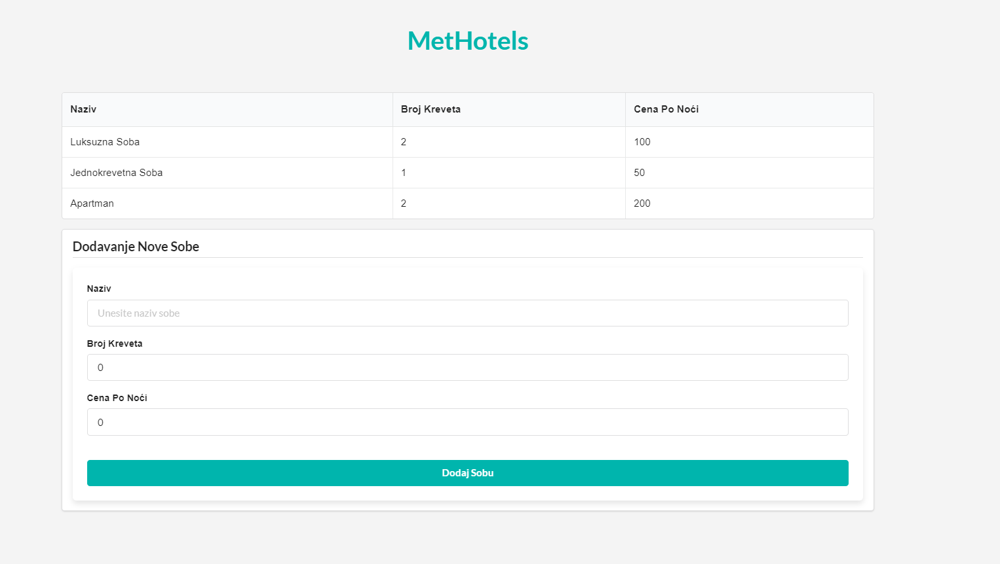

# AngularHotel

This project was developed as part of a school assignment with the objective of demonstrating basic skills and knowledge in the Angular CLI environment.

## Features

- Room creation and management.
- User interface interaction for room data input.
- Displaying room details.

## Technologies Used

- Frontend: Angular CLI
- Styling: CSS

**Note**: The project is currently in development and may undergo additional changes in the future.

This project was generated with [Angular CLI](https://github.com/angular/angular-cli) version 16.2.9.
